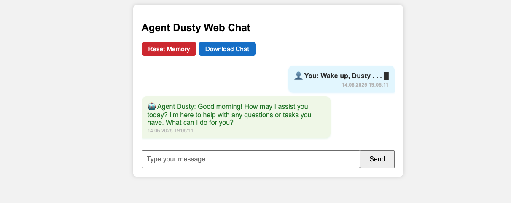

# Agent Dusty

Agent Dusty is a modular agent developed in Python, featuring an integrated SQLite database and a simple web interface. It is designed for rapid prototyping and basic data operations.

## Features

- Written in Python
- Lightweight, integrated SQLite database
- Simple and user-friendly web interface
- Modular structure
- Easy setup and usage

## Installation

1. Clone this repository:
   ```sh
   git clone https://github.com/hzrylmz/HizirAgent.git
   cd HizirAgent
   ```

2. Create a virtual environment and install the required packages:
   ```sh
   python -m venv venv
   source venv/bin/activate      # On Windows: venv\Scripts\activate
   pip install -r requirements.txt  # If requirements.txt is missing, install necessary packages manually.
   ```

3. Start the application:
   ```sh
   python web_app.py
   ```
   or
   ```sh
   flask run
   ```

4. Open your browser and navigate to:
   ```
   http://localhost:5000
   ```

## Screenshot

Below is a screenshot of the main application interface:



## Usage

- Access the web interface to add, edit, or delete records.
- Easily manage your database operations.

## Contributing

If you would like to contribute, please open a pull request or create an issue.  
Suggestions and feedback are always welcome!

## License

This project is licensed under the MIT License.
